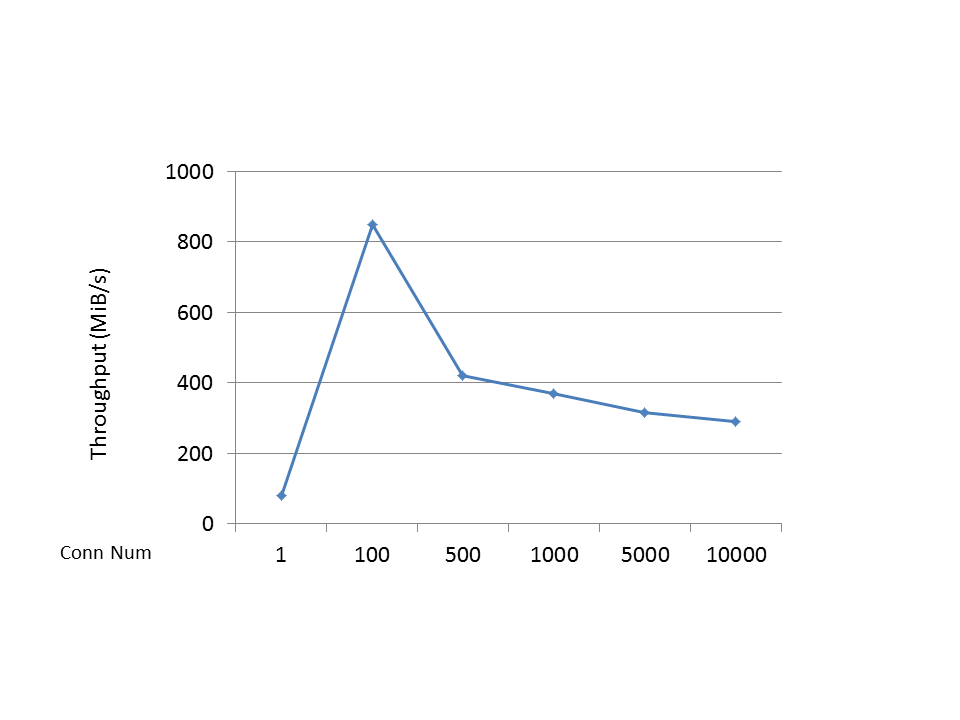

dodo
=======
Cross platform high performance TCP network library and RPC library using C++ 11.

Windows : [](https://ci.appveyor.com/project/IronsDu/dodo/branch/master)  Linux : [](https://travis-ci.org/IronsDu/dodo)

## Features
* Cross platform (Linux | Windows)
* High performance and safety use.
* None depend
* Multi-threaded
* SSL support
* Support HTTP、HTTPS、WebSocket protocol
* IPv6 support
* [RPC Library](https://github.com/IronsDu/dodo/tree/master/src/rpc)

## Benchamrk
   Under localhost, use CentOS 6.5 virtual mahcine(host machine is Win10 i5)
* PingPong

  Benchamrk's server and client both only use one thread, and packet size is 4k

  

* Broadcast

  Server use two network threads and one logic thread, client use one network(also process logic) thread. every packet size is 46 bytes.
  every packet contain client's id.
  server broadcast packet to all client when recv one packet from any client.
  client send one packet when recv packet from server and packet's id equal self.

  

* Ab HTTP(1 network thread)

        Server Software:
        Server Hostname:        127.0.0.1
        Server Port:            8080

        Document Path:          /
        Document Length:        18 bytes

        Concurrency Level:      100
        Time taken for tests:   5.871 seconds
        Complete requests:      100000
        Failed requests:        0
        Write errors:           0
        Non-2xx responses:      100000
        Total transferred:      5200000 bytes
        HTML transferred:       1800000 bytes
        Requests per second:    17031.62 [#/sec] (mean)
        Time per request:       5.871 [ms] (mean)
        Time per request:       0.059 [ms] (mean, across all concurrent requests)
        Transfer rate:          864.89 [Kbytes/sec] received

        Connection Times (ms)
                    min  mean[+/-sd] median   max
        Connect:        0    2   0.7      2       8
        Processing:     1    3   0.7      3       9
        Waiting:        0    3   0.8      3       8
        Total:          2    6   0.8      6      11

        Percentage of the requests served within a certain time (ms)
        50%      6
        66%      6
        75%      6
        80%      6
        90%      7
        95%      7
        98%      7
        99%      8
        100%     11 (longest request)

## About session safety
  This library use three layer ident one session(also is three way to use this library).
  * First, use raw pointer named [DataSocket](https://github.com/IronsDu/dodo/blob/master/src/net/DataSocket.h#L30), combine with [EventLoop](https://github.com/IronsDu/dodo/blob/master/src/net/EventLoop.h) in used
  * Second, use int64_t number ident one session, used in some callback of [TCPService](https://github.com/IronsDu/dodo/blob/master/src/net/TCPService.h#L53) that wrapper DataSocket of first layer
  * Thrid, use smart pointer named [TCPSession::PTR](https://github.com/IronsDu/dodo/blob/master/src/net/WrapTCPService.h#L13) combine with [WrapServer](https://github.com/IronsDu/dodo/blob/master/src/net/WrapTCPService.h#L70), you can control session by [TCPSession::PTR](https://github.com/IronsDu/dodo/blob/master/src/net/WrapTCPService.h#L13)

I suggest you use the second or thrid way above, because don't worry memory manager

## Usage
  About TCP Library ,Please see [examples](https://github.com/IronsDu/dodo/tree/master/examples);

## About RPC
  Use this RPC library, you not need any proto file sush as Protobuf and Thrift, because i use C++ Template Generic Programming do this work.
  
  you can [click here](https://github.com/IronsDu/DServerFramework/blob/master/DDServerFramework/src/test/CenterServerExt.cpp) see example.
  
  The RPC support any C++ base type, sush as int、string、vector、map, and support Protobuf Message Type; Of course, RPC can use async callback mode, when you need process RPC reply msg return from server.
  
  On server side:
```cpp
static int add(int a, int b)
{
    //CenterServerRPCMgr::getRpcFromer()为调用者会话对象
    return a + b;
}

static void addNoneRet(int a, int b, dodo::rpc::RpcRequestInfo reqInfo)
{
    // 添加dodo::rpc::RpcRequestInfo reqInfo形参(不影响调用者调用)
    // 这里本身不返回数据(函数返回类型为void),但RPC本身是具有返回值语义的
    // 适用于需要调用其他异步操作之后(通过reqInfo)才能返回数据给调用者的情况
    // 譬如:
    /*
        auto caller = CenterServerRPCMgr::getRpcFromer();
        redis->get("k", [caller, reqInfo](const std::string& value){
            caller->reply(reqInfo, value);
        });
    */

    /*
        //客户端:
        centerServerConnectionRpc->call("test", 1, 2, [](const std::string& value){
        });
    */
}

void initCenterServerExt()
{
    CenterServerRPCMgr::def("test", [](int a, int b){
        return a + b;
    });

    CenterServerRPCMgr::def("testNoneRet", [](int a, int b){
    });

    CenterServerRPCMgr::def("add", add);

    CenterServerRPCMgr::def("addNoneRet", addNoneRet);
}
```

On client side:

```cpp
gLogicCenterServerClient->call("test", 1, 2);
gLogicCenterServerClient->call("add", 1, 2);
gLogicCenterServerClient->call("add", 1, 2, [](int result) {
    cout << result << endl;
});
```

## Example
* [PingPongServer](https://github.com/IronsDu/dodo/blob/master/examples/PingPongServer.cpp)
* [PingPongClient](https://github.com/IronsDu/dodo/blob/master/examples/PingPongClient.cpp)
* [BroadCastServer](https://github.com/IronsDu/dodo/blob/master/examples/BroadCastServer.cpp)
* [BroadCastClient](https://github.com/IronsDu/dodo/blob/master/examples/BroadCastClient.cpp)
* [SimpleHttpServer](https://github.com/IronsDu/dodo/blob/master/examples/TestHttp.cpp) show how to start http service and request http
* [BenchWebsocket](https://github.com/IronsDu/dodo/blob/master/examples/BenchWebsocket.cpp) benchmark websocket server
* [WebSocketProxy](https://github.com/IronsDu/dodo/blob/master/examples/WebBinaryProxy.cpp) one proxy server between websocket client and binary protocol server
* [SimpleRpcServer](https://github.com/IronsDu/dodo/blob/master/examples/SimpleRpcServer.cpp) rpc server use http and protobuf

## Users
* [Redis proxy](https://github.com/IronsDu/DBProxy)
* [Distributed game server framework](https://github.com/IronsDu/DServerFramework)
* [Joynet - lua network library](https://github.com/IronsDu/Joynet)
